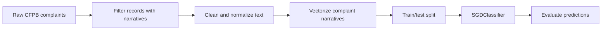

# Consumer Complaints Classification

A text classification project for routing Consumer Financial Protection Bureau complaint narratives into financial product categories.

## Problem

Financial institutions and regulators receive large volumes of consumer complaints. Manual triage is slow, inconsistent, and difficult to scale. Complaint narratives can be used to predict the product category and route cases faster, but the dataset is large, text-heavy, and class-imbalanced.

This project explores a scalable NLP workflow for classifying complaint narratives.

## Dataset / Source

The project uses complaint data from the Consumer Financial Protection Bureau (CFPB) Consumer Complaint Database.

- Source: https://www.consumerfinance.gov/data-research/consumer-complaints/
- Records processed in the notebook: 887,808 complaints with narratives
- Target: `Product`
- Main text feature: `Consumer complaint narrative`
- Additional fields explored: `Sub-product`, `Issue`, and `Sub-issue`

The raw CFPB database contains millions of complaints, but many records do not include public complaint narratives. The modeling workflow filters to records with usable narrative text.

## Tech Stack

- Python
- pandas / NumPy
- scikit-learn
- NLTK
- Matplotlib / Seaborn
- Jupyter Notebook

## Architecture / Workflow


```mermaid
flowchart LR
    A[Raw CFPB complaints] --> B[Filter records with narratives]
    B --> C[Clean and normalize text]
    C --> D[Vectorize complaint narratives]
    D --> E[Train/test split]
    E --> F[SGDClassifier]
    F --> G[Evaluate predictions]
```

Supporting modules:

| File | Purpose |
|---|---|
| [complaints.ipynb](complaints.ipynb) | Main notebook for exploration, preprocessing, modeling, and evaluation |
| [text_cleaner.py](text_cleaner.py) | Reusable text cleaning helpers |
| [text_cleaner_prompt.py](text_cleaner_prompt.py) | Prompt/context helper for text cleaner work |
| [requirements.txt](requirements.txt) | Python dependencies |

## Modeling Approach

The notebook uses a large-scale linear classification workflow:

- Filter to complaints with narrative text.
- Use complaint narratives as model input.
- Use `Product` as the target label.
- Convert text into sparse numeric features.
- Train an `SGDClassifier`, which is suitable for high-dimensional sparse text data.
- Evaluate predictions on a held-out split.

## Results / Hiring Evidence

This project shows:

- Large-scale text preprocessing on 887,808 complaint narratives.
- Multi-class classification across financial product categories.
- Practical handling of severe class imbalance.
- A reusable text cleaning utility for NLP workflows.
- Model selection based on scale: sparse features plus a linear classifier.

Key dataset characteristics documented in the project:

| Characteristic | Value |
|---|---:|
| Processed complaint narratives | 887,808 |
| Product categories | 18+ |
| Largest class share | Credit reporting services, about 57% |
| Train/test split | 67% / 33% |

## How to Run

1. Clone the repository.

```bash
git clone https://github.com/LukeOpany/consumer-complaints-classification.git
cd consumer-complaints-classification
```

2. Create and activate a virtual environment.

```bash
python3 -m venv .venv
source .venv/bin/activate
```

3. Install dependencies.

```bash
pip install -r requirements.txt
```

4. Open the notebook.

```bash
jupyter notebook complaints.ipynb
```

## What I Learned / Production Improvements

This project demonstrates:

- Scaling NLP preprocessing to hundreds of thousands of records.
- Turning free-text complaint narratives into model-ready features.
- Thinking beyond accuracy when classes are heavily imbalanced.
- Choosing a classifier that fits sparse high-dimensional text data.

Production next steps:

- Move preprocessing and training code from notebook cells into a versioned Python pipeline.
- Save the vectorizer and trained model with `joblib`.
- Add a clear evaluation table with accuracy, macro F1, weighted F1, and per-class recall.
- Add model explainability with top weighted terms per product category.
- Add a FastAPI endpoint for complaint-category inference.
- Add monitoring for class drift and confidence thresholds.
